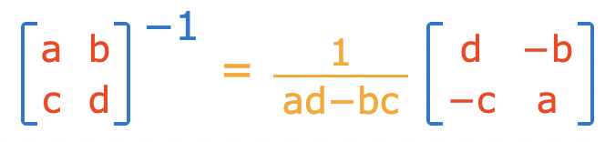
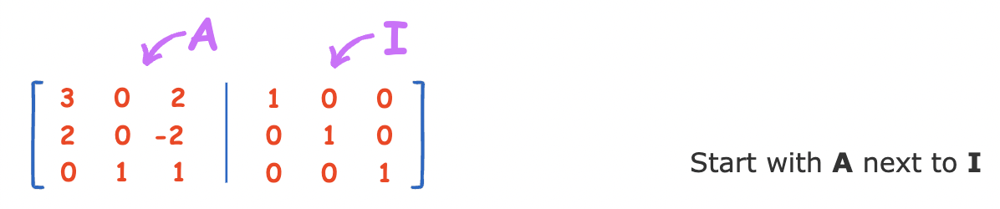
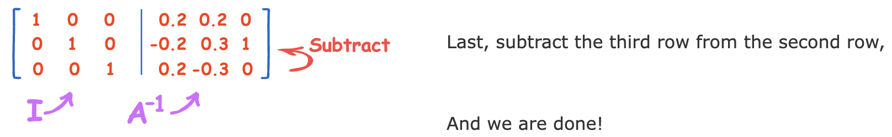

### Definitions:
bijective = one-to-one representation

invertible transformation = transformation that has an existing inverse transformation that undoes it

Inverse definition: $AA^{-1}=I$

### Theorems:
If $T$ is invertible, $T(x) = y$ has a unique solution for every $y$ in $R^n$

2x2 Invertibility Theorem: If $ad - bc = 0$, then $[a b; c d]$ is not invertible

nxn Invertibility Theorem: If $\mathrm{rref}[A:I]$ gives diagonal 1's w 0's as $A$, then invertible and right side is I

If $Ax=y$, then $x=A^{-1}y$

### Inverses:

- Also, matrix inverse calculator: https://www.wolframalpha.com/calculators/matrix-inverse-calculator

### Basis
$|x|_\mathcal{B} = [3; 14]$ means $x = 3v_1 + 14v_2$