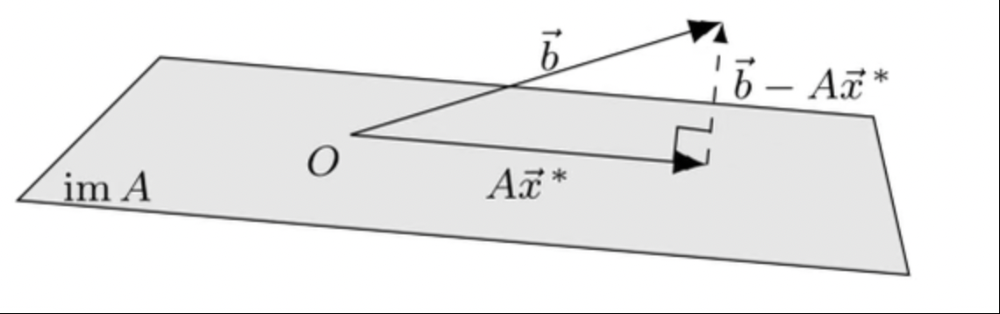

### Least Squares Fitting
- make a consistent problem to solve for inconsistent systems

also, $\mathrm{ker}(A^T)=(\mathrm{im}A)^\bot$
and $(\mathrm{ker}A)^\bot=\mathrm{im}(A^T)$
**ask melissa why exactly**

For inconsistent system $Ax=b$
The least sqs solution $=x^*=$ solution of $A^TAx^*=A^Tb$
**also ask melissa why exactly**

**also, also ask melissa why there is something ab $\mathrm{proj}$s**

So $f_\textrm{best fit}=x_{1}^*+x_{2}^*g+x_{3}^*h+...$
